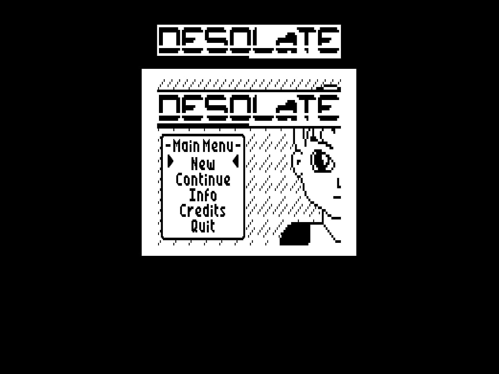
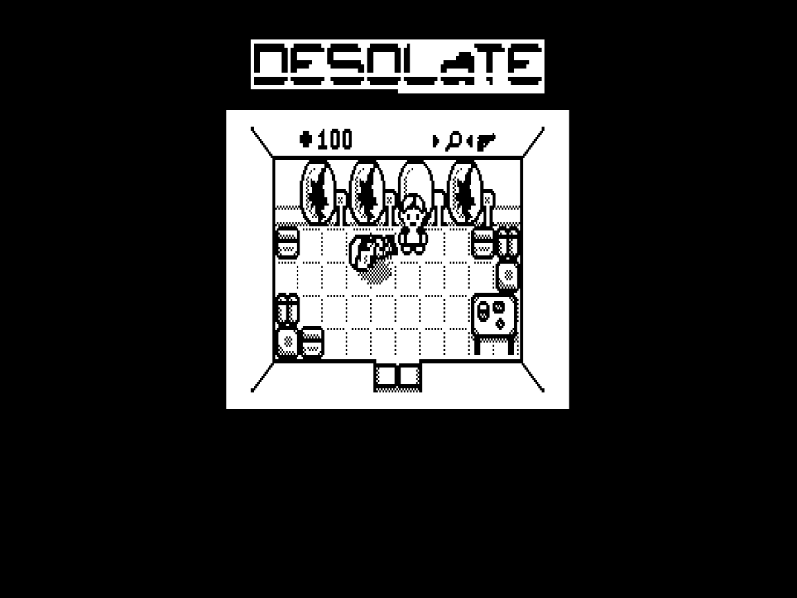

# korvet-desolate
Porting **Desolate** game from TI-83 Plus calculator to soviet computer [Korvet](https://en.wikipedia.org/wiki/Corvette_(computer)) (Корвет).

Porting status: released, in December 2024.

 

## The original game

Written by Patrick Prendergast (tr1p1ea) for TI-83/TI-84 calculators.

Links:
 - [Desolate game description and files](https://www.ticalc.org/archives/files/fileinfo/348/34879.html)
 - [Wabbit emulator site](http://wabbitemu.org/) and [GitHub](https://github.com/sputt/wabbitemu)

To run the game on Wabbitemu emulator:
 1. Run Wabbitemu, select ROM file
 2. File Open `DesData.8xp`
 3. <kbd>MEM</kbd>, select Archive; <kbd>PRGM</kbd>, select DesData; <kbd>ENTER</kbd>
 4. File Open `Desolate.8xp`
 5. File Open `MIRAGEOS.8xk`
 6. <kbd>APPS</kbd> select MirageOS
 7. Select Main > Desolate

## Tools for the tools folder

 - `pasmo.exe` cross-assembler
   http://pasmo.speccy.org/
 - `salvador.exe` ZX0 compressor
   https://github.com/emmanuel-marty/salvador/releases
 - `xkorvet.exe` https://bitbucket.org/marinovsoft/xkorvet/src/master/

## Links

 - [Discussion on zx-pk.ru (in Russian)](https://zx-pk.ru/threads/36044-portirovanie-igry-desolate-na-korvet.html)
 - [Desolate port on ZX Spectrum](https://github.com/nzeemin/spectrum-desolate)
 - [Desolate port on UKNC](https://github.com/nzeemin/uknc-desolate)

